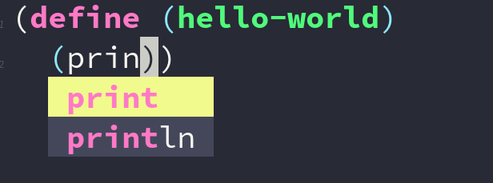

# company-gambit



a backend for company gambit

## Description
This is a very simple company backend for gambit, for emacs

It finds all the procedures in the gambit documentation and provides them to [company](https://github.com/company-mode/company-mode).

### why?
I'm doing it to learn a few things, company backends, regular expressions, lisp in general.

In addition gambit comes with a pretty nice [gambit-mode](https://github.com/gambit/gambit/blob/master/misc/gambit.el), the only thing missing was autocomplete, hence this project. 

"why don't you just use [geiser](https://gitlab.com/emacs-geiser/gambit)?"

you should definitely just use geiser

## Installation

### straight package manager

[straight](https://github.com/raxod502/straight.el) is a package manager for emacs, its really handy. No git cloning required!

```emacs
(use-package company-gambit
    :straight (company-gambit :type git :host github :repo "DrAtomic/company-gambit")
    :config
    (defun my-scheme-mode-hook ()
      (add-to-list 'company-backends 'company-gambit--backend))
    (add-hook 'scheme-mode-hook 'my-scheme-mode-hook))
```

### git installation
```
cd ~/.emacs.d
git clone https://github.com/DrAtomic/company-gambit.git
```

go into your emacs config file and add

```emacs
(use-package company-gambit
  :ensure nil
  :load-path "~/.emacs.d/company-gambit/"
  :config
  (defun my-scheme-mode-hook ()
    (add-to-list 'company-backends 'company-gambit--backend))

  (add-hook 'scheme-mode-hook 'my-scheme-mode-hook))

```

now start up a .scm file and you're good to go!
